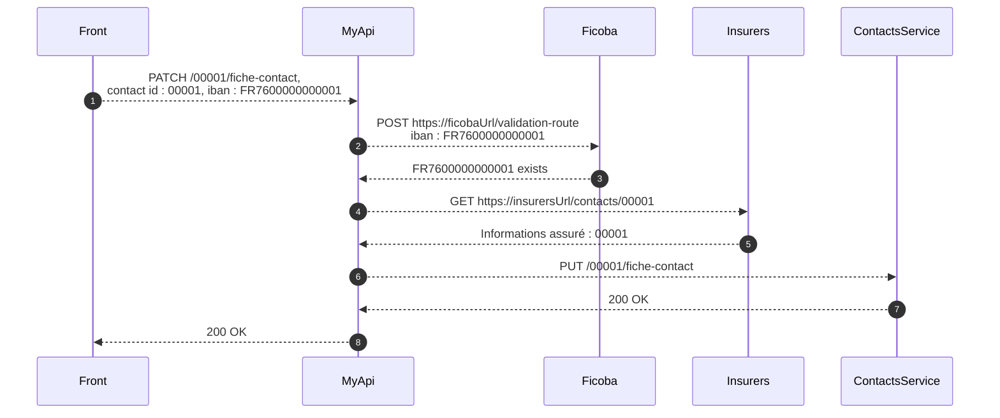

# Living documentation : sequence diagram as code

Sample of code that generates mermaidjs sequence diagram.
During the execution of the code, if a specific logger configuration is enabled, the program will output logs that can be interpreted as sequence diagrame in mermaidjs.

## Running tests

### Run tests with mermaid output

Using this maven profile (`mermaid`), tests log output should show some mermaid code.
You can then copy and paste it in https://mermaid.live/edit

```shell
mvn test -Pmermaid
```

Example of output : 

```
[INFO] 
[INFO] -------------------------------------------------------
[INFO]  T E S T S
[INFO] -------------------------------------------------------
[INFO] Running fr.baldir.UpdatingContactIbanTest

%% Updating contact's IBAN : when iban is valid

sequenceDiagram
autonumber
Front -->> MyApi : PATCH /00001/fiche-contact, <br/> contact id : 00001, iban : FR7600000000001
MyApi -->> Ficoba : POST https://ficobaUrl/validation-route <br/> iban : FR7600000000001
Ficoba -->> MyApi : FR7600000000001 exists
MyApi -->> Insurers : GET https://insurersUrl/contacts/00001
Insurers -->> MyApi : Informations assuré : 00001
MyApi -->> ContactsService : PUT /00001/fiche-contact
ContactsService -->> MyApi : 200 OK
MyApi -->> Front : 200 OK

%% Updating contact's IBAN : when iban is not found

sequenceDiagram
autonumber
Front -->> MyApi : PATCH /00001/fiche-contact, <br/> contact id : 00001, iban : FR7600000000000
MyApi -->> Ficoba : POST https://ficobaUrl/validation-route <br/> iban : FR7600000000000
Ficoba -->> MyApi : FR7600000000000 does not exist
MyApi -->> Front : 400 Bad Request
[INFO] Tests run: 2, Failures: 0, Errors: 0, Skipped: 0, Time elapsed: 0.428 s - in fr.baldir.UpdatingContactIbanTest
[INFO] 
[INFO] Results:
[INFO] 
[INFO] Tests run: 2, Failures: 0, Errors: 0, Skipped: 0
[INFO] 
```


### Run as regular tests

```shell
mvn test
```

Example of output

```
[INFO] 
[INFO] -------------------------------------------------------
[INFO]  T E S T S
[INFO] -------------------------------------------------------
[INFO] Running fr.baldir.UpdatingContactIbanTest
20:07:05.258 [main] INFO  fr.baldir.UpdatingContactIbanTest -- Updating contact's IBAN : when iban is valid. Log visible in 'normal' test runs but not in 'mermaid' run
20:07:05.268 [main] INFO  fr.baldir.UpdatingContactIbanTest -- Updating contact's IBAN : when iban is not found. Log visible in 'normal' test runs but not in 'mermaid' run
[INFO] Tests run: 2, Failures: 0, Errors: 0, Skipped: 0, Time elapsed: 0.155 s - in fr.baldir.UpdatingContactIbanTest
[INFO] 
[INFO] Results:
[INFO] 
[INFO] Tests run: 2, Failures: 0, Errors: 0, Skipped: 0
[INFO] 
```


## Writing diagrams

Example of use

1. Add a logger named "mermaid"
2. trace before and after call to external service

Here, we traced in `Insurances.java`

```java
public class Insurances {
    Logger mermaidLog = LoggerFactory.getLogger("mermaid");

    public InsuredDetails loadInsuredDetails(String contactId) {
        var insurersUrl = "https://insurersUrl/contacts/" + contactId;
        
        // Trace before remote call
        mermaidLog.trace("MyApi -->> Insurers : GET {}", insurersUrl);
        // simulate some API call to Insurers service
        var insuredDetails = new InsuredDetails(contactId);
        // Trace after remote call
        mermaidLog.trace("Insurers -->> MyApi : {}", insuredDetails.render());
        
        
        return insuredDetails;
    }

    public record InsuredDetails(String contactId) {
        public String render() {
            return "Informations assuré : " + contactId;
        }
    }
}
```

In tests, you can add diagram headers

```java
@DisplayName("Updating contact's IBAN")
@IndicativeSentencesGeneration(separator = " : ", generator = DisplayNameGenerator.ReplaceUnderscores.class)
public class UpdatingContactIbanTest {
    Logger mermaidLog = LoggerFactory.getLogger("mermaid");

    private Logger log = LoggerFactory.getLogger(UpdatingContactIbanTest.class);
    private FicheContactController ficheContactController;

    @BeforeEach
    void setUp(TestInfo testInfo) {
        ficheContactController = createSut();

        log.info(testInfo.getDisplayName() + ". Log visible in 'normal' test runs but not in 'mermaid' run");
        
        // Some layout and diagram title as %% mermaid comment
        mermaidLog.trace("");
        mermaidLog.trace("%% " + testInfo.getDisplayName());
        mermaidLog.trace("");

        // Mermaid diagram headers and options
        mermaidLog.trace("sequenceDiagram");
        mermaidLog.trace("autonumber");
    }
    // ... omitted for brevity
}
```

Then, running tests will output desired diagrams.

```java
public class UpdatingContactIbanTest {
    // ... omitted for brevity

    @Test
    void when_iban_is_valid() {
        var contactId = "00001";
        var iban = "FR7600000000001";

        ficheContactController.patchFicheContact(new FicheContactPatch(contactId, iban));
    }
}
```

Generated diagram



### Logging configuration

In this example we have 2 separate Logback logger configurations.
- A standard one : `src/test/resources/logback-test.xml`
- A specific for mermaid diagram generation : `src/test/resources/logback-mermaid.xml`

This `logback-mermaid.xml`
- remove noise in output and only prints the raw message
- only outputs logs from the logger called `"mermaid"`
  - to declare this logger in java code : `Logger mermaidLog = LoggerFactory.getLogger("mermaid");`

Why logging mermaid in `"TRACE"` log level?

Because in the standard logger, we may not want to output the mermaid logs.
We could filter them out if we want, or enable them in production.

